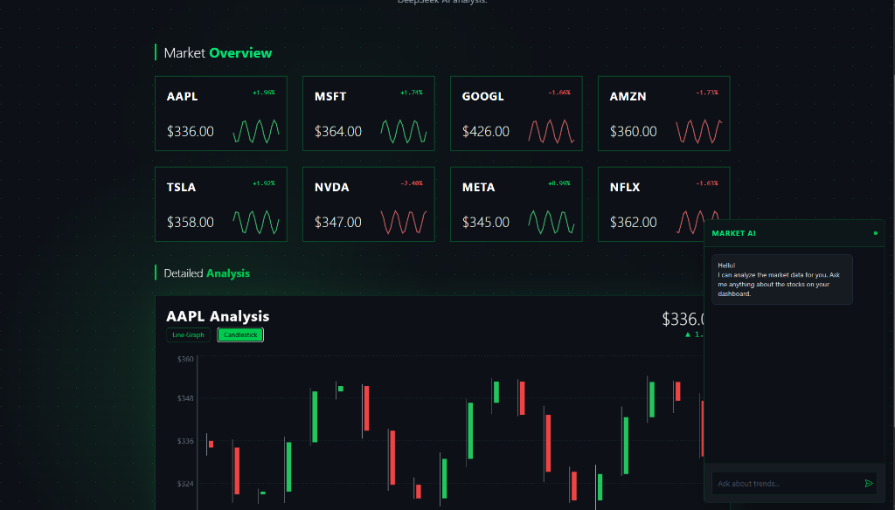

# Rapid Nova 🚀

Rapid Nova is a modern **Stock Assessment & RAG Application** built with React and Vite. It combines real-time financial data with advanced AI capabilities to provide intelligent stock insights.



## ✨ Features

- **Real-Time Market Data**: Fetches up-to-date stock quotes, company details, and market status using the **Massive API**.
- **AI-Powered Insights (RAG)**: Integrated **DeepSeek AI** chat interface that uses Retrieval-Augmented Generation (RAG) to answer questions based on the current market data context.
- **Interactive Dashboard**: Clean, responsive UI featuring stock tiles and detailed charts powered by **Recharts**.
- **Dynamic Visuals**: Immersive background effects and polished tailored aesthetics using **TailwindCSS**.

## 🛠️ Tech Stack

- **Frontend**: React 19, Vite
- **Styling**: TailwindCSS
- **Charts**: Recharts
- **AI/LLM**: DeepSeek API
- **Data Provider**: Massive API (Polygon.io compatible)
- **Markdown**: React Markdown

## 🚀 Getting Started

### Prerequisites

- Node.js installed on your machine.
- API Keys for **Massive** (Data) and **DeepSeek** (AI).

### Installation

1.  **Clone the repository:**
    ```bash
    git clone <repository-url>
    cd rapid-nova
    ```

2.  **Install dependencies:**
    ```bash
    npm install
    ```

3.  **Configure Environment Variables:**
    Create a `.env` file in the root directory and add your keys:
    ```env
    VITE_MASSIVE_API_KEY=your_massive_api_key_here
    VITE_DEEPSEEK_API_KEY=your_deepseek_api_key_here
    ```

    > [!IMPORTANT]
    > **Security Note:** Ensure your `.env` file is included in your `.gitignore` to prevent exposing your secrets. If you previously committed it, remove it from the git index with `git rm --cached .env`.

4.  **Run the application:**
    ```bash
    npm run dev
    ```

## 📂 Project Structure

- `src/components`: UI components (Dashboard, ChatInterface, StockDetails, etc.)
- `src/services`: API integration logic (Massive & DeepSeek services).
- `src/App.jsx`: Main application layout and state management.

---

*Built for the Future of Financial Intelligence.*
